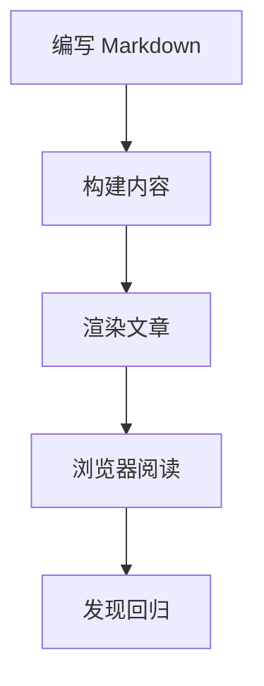

这篇文章是博客的长期样式指南。它不是从零开始讲解 Markdown，而是用来展示常见写作模式经过内容管线、排版规则、语法高亮、Mermaid 渲染和脚注处理之后的实际效果。

每次调整主题时，这个页面都应该能帮助快速发现视觉回归。

## 段落与阅读节奏

**语法**

```md
段落是一块文本，段落之间用空行分隔。

第二个段落从空行后开始，应该保持同样的栏宽、行高和段落间距。
```

**效果**

段落是一块文本，段落之间用空行分隔。长文排版应该保持舒适的阅读宽度、足够的行高，以及稳定的段落间距。文章栏在手机、平板和桌面屏幕上都应该保持可读。

第二个段落从空行后开始。它应该和前一段保持关联，但又不会贴得太近。许多细小的间距问题通常会在这里暴露出来。

## 标题

**语法**

```md
## 章节标题

### 小节标题

#### 细节标题
```

**效果**

### 小节标题

小节标题用于引入一个聚焦的主题。它应该容易被扫读发现，但不应该压过正文。

#### 细节标题

细节标题适合放在较大章节内部，用于短说明、示例和局部结构。

## 行内格式

行内格式适合强调和技术细节：**加粗文本**、_强调文本_、`行内代码`、~~删除文本~~，以及一个 [普通链接](https://astro.build)。多语言混排也应该自然：English text 可以和中文、そして日本語 放在同一行里，而不会破坏阅读节奏。

技术写作里有些行内 HTML 也很有用：H<sub>2</sub>O、x<sup>2</sup>、<abbr title="Internationalization">i18n</abbr>、<kbd>⌘</kbd> + <kbd>K</kbd>，以及 <mark>高亮文本</mark>。

## 引用块

**语法**

```md
> 好的排版会让结构可见，但不会让页面显得忙乱。
>
> 引用中也可以包含 **强调**、链接和多个段落。
```

**效果**

> 好的排版会让结构可见，但不会让页面显得忙乱。
>
> 引用中也可以包含 **强调**、链接和多个段落。好的引用样式应该明显区别于正文，同时仍然属于整篇文章的视觉系统。

引用后的段落应该干净地回到正常正文节奏。

## 列表

无序列表适合展示功能摘要：

- 排版应该保留稳定的间距。
- 链接应该清晰可见并且易于访问。
- 较长的列表项应该自然换行，不应把内容推出文章栏。

有序列表适合展示流程：

1. 写下草稿。
2. 预览文章。
3. 检查窄屏和宽屏。
4. 确认格式正确后发布。

嵌套列表应该保持可扫读：

- 内容检查
  - 标题
  - 段落
  - 链接
- 媒体检查
  - 图片
  - Mermaid 图表
  - 代码块

任务列表适合做兼容性检查：

- [x] 段落
- [x] 列表
- [x] 表格
- [x] 脚注
- [ ] 打印样式

## 表格

表格应该紧凑、易读，并且在窄屏上保持安全。

| 功能     | Markdown 语法                  | 预期效果     |
| -------- | ------------------------------ | ------------ |
| 加粗文本 | `**bold**`                     | 强调显示     |
| 行内代码 | `` `const value = 1` ``        | 等宽行内文本 |
| 链接     | `[Astro](https://astro.build)` | 可访问的链接 |
| 脚注     | `[^note]`                      | 可跳转标记   |

## 代码块

使用带语言标记的围栏代码块，这样语法高亮才能选择正确的语法。

```ts
type BlogPost = {
  title: string;
  description: string;
  tags: string[];
};

function summarizePost(post: BlogPost) {
  return `${post.title} — ${post.description}`;
}
```

命令行代码也应该清晰显示：

```bash
pnpm install
pnpm dev
pnpm build
```

如果要展示本身包含围栏代码块的 Markdown 源码，可以在外层使用更长的围栏：

````md
```ts
console.log("Nested fence example");
```
````

## 图片

图片应该遵循文章宽度，保持原始比例，并提供有意义的替代文本。


## 图表

Mermaid 图表应该渲染为 SVG，同时在 Markdown 中保留源图表文本。图表可以在行内缩放，溢出时可以拖动，并且可以通过展开按钮打开查看。



## 分隔线

水平分隔线可以把相关但不同的内容区块分开。

---

分隔线之后的间距应该显得有意图，而不是突然断开。

## 脚注

脚注适合放置不想打断正文的小补充。这个句子包含一个用于检查渲染流程的短脚注。[^markdown-footnote]

另一个句子也可以使用第二条脚注，把更细的说明放到文章底部。[^second-note]

## 总结

一篇好的示例文章应该覆盖足够多的主题能力，但仍然要能读。如果未来的样式改动影响了标题、列表、引用、代码块、图表或脚注，这个页面应该能让问题变得明显。

[^markdown-footnote]: 这条脚注用于确认 GFM 脚注定义会渲染在视觉上独立的脚注区域，并且能链接回正文中的引用位置。

[^second-note]: 多条脚注应该保持一致的间距、编号和返回链接。
