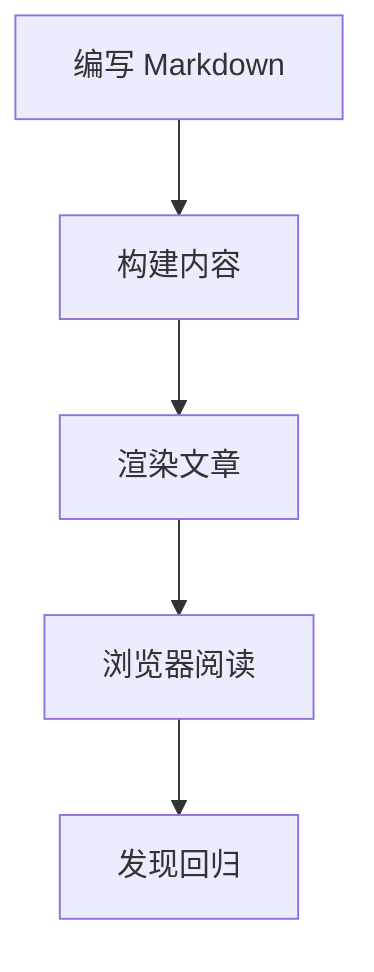

This article is the blog's long-term style guide. It doesn't explain Markdown from scratch, but rather demonstrates how common writing patterns look after passing through the content pipeline, typography rules, syntax highlighting, Mermaid rendering, and footnote handling.

Whenever the theme is adjusted, this page should help quickly spot visual regressions.

## Paragraphs and Reading Rhythm

**Syntax**

```md
段落是一块文本，段落之间用空行分隔。

第二个段落从空行后开始，应该保持同样的栏宽、行高和段落间距。
```

**Effect**

A paragraph is a block of text, separated from other paragraphs by a blank line. Long-form typography should maintain a comfortable reading width, sufficient line height, and stable paragraph spacing. The article column should remain readable on phone, tablet, and desktop screens.

The second paragraph starts after a blank line. It should feel connected to the previous paragraph without being too close. Many subtle spacing issues usually surface here.

## Headings

**Syntax**

```md
## 章节标题

### 小节标题

#### 细节标题
```

**Effect**

### Subsection heading

Subsection headings are used to introduce a focused topic. They should be easy to discover when scanning, but should not overpower the body text.

#### Detail heading

Detail headings work well inside larger sections, for short notes, examples, and local structure.

## Inline Formatting

Inline formatting is good for emphasis and technical details: **bold text**, _emphasized text_, `行内代码`, ~~deleted text~~, and a [regular link](https://astro.build). Mixed-language typesetting should also feel natural: English text can sit on the same line as 中文 and そして日本語 without breaking the reading rhythm.

Some inline HTML is also useful in technical writing: H<sub>2</sub>O, x<sup>2</sup>, <abbr title="Internationalization">i18n</abbr>, <kbd>⌘</kbd> + <kbd>K</kbd>, and <mark>highlighted text</mark>.

## Blockquotes

**Syntax**

```md
> 好的排版会让结构可见，但不会让页面显得忙乱。
>
> 引用中也可以包含 **强调**、链接和多个段落。
```

**Effect**

> Good typography makes structure visible without making the page feel busy.
>
> Blockquotes can also contain **emphasis**, links, and multiple paragraphs. A good blockquote style should be clearly distinct from body text while still belonging to the article's overall visual system.

The paragraph after the blockquote should cleanly return to the normal body rhythm.

## Lists

Unordered lists are good for feature summaries:

- Typography should preserve stable spacing.
- Links should be clearly visible and accessible.
- Longer list items should wrap naturally without pushing content out of the article column.

Ordered lists are good for processes:

1. Write a draft.
2. Preview the article.
3. Check narrow and wide screens.
4. Publish after confirming the formatting is correct.

Nested lists should remain scannable:

- Content checks
  - Headings
  - Paragraphs
  - Links
- Media checks
  - Images
  - Mermaid diagrams
  - Code blocks

Task lists are good for compatibility checks:

- [x] Paragraphs
- [x] Lists
- [x] Tables
- [x] Footnotes
- [ ] Print styles

## Tables

Tables should be compact, readable, and safe on narrow screens.

| Feature     | Markdown syntax                  | Expected result     |
| -------- | ------------------------------ | ------------ |
| Bold text | `**bold**`                     | Emphasized display     |
| Inline code | `` `const value = 1` ``        | Monospace inline text |
| Link     | `[Astro](https://astro.build)` | Accessible link |
| Footnote     | `[^note]`                      | Jumpable marker   |

## Code Blocks

Use fenced code blocks with a language tag so syntax highlighting can select the correct grammar.

```ts
type BlogPost = {
  title: string;
  description: string;
  tags: string[];
};

function summarizePost(post: BlogPost) {
  return `${post.title} — ${post.description}`;
}
```

Command-line code should also display clearly:

```bash
pnpm install
pnpm dev
pnpm build
```

To show Markdown source that itself contains fenced code blocks, use a longer fence on the outer layer:

````md
```ts
console.log("Nested fence example");
```
````

## Images

Images should follow the article width, maintain their original aspect ratio, and provide meaningful alternative text.


## Diagrams

Mermaid diagrams should render as SVG while preserving the source diagram text in the Markdown. Diagrams can be scaled inline, dragged when overflowing, and opened via an expand button.



## Horizontal Rules

Horizontal rules can separate related but distinct content sections.

---

The spacing after a horizontal rule should feel intentional, not abrupt.

## Footnotes

Footnotes are good for small additions you don't want to interrupt the body text. This sentence contains a short footnote for checking the rendering pipeline.[^markdown-footnote]

Another sentence can also use a second footnote, placing more detailed notes at the bottom of the article.[^second-note]

## Summary

A good sample article should cover enough of the theme's capabilities while still being readable. If future style changes affect headings, lists, blockquotes, code blocks, diagrams, or footnotes, this page should make the problems obvious.

[^markdown-footnote]: This footnote confirms that GFM footnote definitions render in a visually separate footnote area and link back to the reference position in the body text.

[^second-note]: Multiple footnotes should maintain consistent spacing, numbering, and return links.
