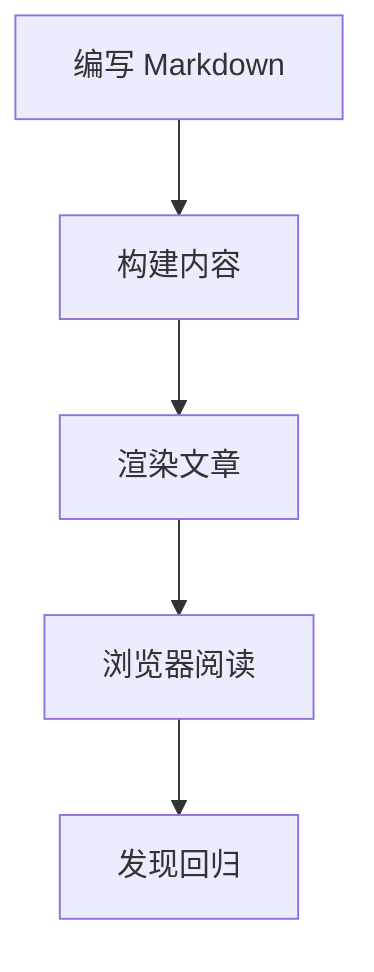

この記事はブログの長期的なスタイルガイドです。Markdown をゼロから解説するものではなく、一般的な執筆パターンがコンテンツパイプライン、タイポグラフィ、シンタックスハイライト、Mermaid レンダリング、脚注処理を経た後の実際の見え方を示すためのものです。

テーマを調整するたびに、このページは視覚的なリグレッションを素早く発見するのに役立つはずです。

## 段落と読書リズム

**構文**

```md
段落はテキストのまとまりであり、段落間は空行で区切ります。

2 番目の段落は空行の後に始まり、同じカラム幅、行高、段落間隔を維持する必要があります。
```

**表示例**

段落はテキストのまとまりであり、段落間は空行で区切ります。長文のタイポグラフィは、快適な読み幅、十分な行高、安定した段落間隔を維持する必要があります。記事のカラムは、スマートフォン、タブレット、デスクトップ画面のすべてで読みやすさを保つ必要があります。

2 番目の段落は空行の後に始まります。前の段落との関連性を保ちつつ、近づきすぎないようにする必要があります。多くの細かい間隔の問題は、通常ここで明らかになります。

## 見出し

**構文**

```md
## 章見出し

### 節見出し

#### 詳細見出し
```

**表示例**

### 節見出し

節見出しは、焦点を絞ったトピックを導入するために使用します。スキャンしやすく見つけやすい一方で、本文を圧倒しないようにする必要があります。

#### 詳細見出し

詳細見出しは、より大きなセクション内で、短い説明、例、部分的な構造に適しています。

## インライン書式

インライン書式は強調や技術的な詳細に適しています：**太字テキスト**、_強調テキスト_、`インラインコード`、~~削除テキスト~~、そして [通常リンク](https://astro.build)。多言語の混在も自然であるべきです：English text は中文、そして日本語と同じ行に置いても、読書のリズムを壊しません。

技術文書では、いくつかのインライン HTML も便利です：H<sub>2</sub>O、x<sup>2</sup>、<abbr title="Internationalization">i18n</abbr>、<kbd>⌘</kbd> + <kbd>K</kbd>、そして <mark>ハイライトテキスト</mark>。

## 引用ブロック

**構文**

```md
> 優れたタイポグラフィは構造を可視化しますが、ページを雑然と見せることはありません。
>
> 引用には **強調**、リンク、複数の段落を含めることもできます。
```

**表示例**

> 優れたタイポグラフィは構造を可視化しますが、ページを雑然と見せることはありません。
>
> 引用には **強調**、リンク、複数の段落を含めることもできます。優れた引用スタイルは本文と明確に区別できる一方で、記事全体のビジュアルシステムの一部であり続ける必要があります。

引用の後の段落は、通常の本文のリズムにきれいに戻る必要があります。

## リスト

順序なしリストは機能の概要を示すのに適しています：

- タイポグラフィは安定した間隔を維持する必要があります。
- リンクは明確に見え、アクセスしやすい必要があります。
- 長いリスト項目は自然に折り返し、コンテンツを記事のカラムからはみ出させないようにする必要があります。

順序付きリストはプロセスを示すのに適しています：

1. 下書きを書きます。
2. 記事をプレビューします。
3. 狭い画面と広い画面を確認します。
4. 書式が正しいことを確認して公開します。

ネストされたリストはスキャンしやすさを維持する必要があります：

- コンテンツの確認
  - 見出し
  - 段落
  - リンク
- メディアの確認
  - 画像
  - Mermaid ダイアグラム
  - コードブロック

タスクリストは互換性チェックに適しています：

- [x] 段落
- [x] リスト
- [x] テーブル
- [x] 脚注
- [ ] 印刷スタイル

## テーブル

テーブルはコンパクトで読みやすく、狭い画面でも安全である必要があります。

| 機能             | Markdown 構文                  | 期待される効果             |
| ---------------- | ------------------------------ | -------------------------- |
| 太字テキスト     | `**bold**`                     | 強調表示                   |
| インラインコード | `` `const value = 1` ``        | 等幅インラインテキスト     |
| リンク           | `[Astro](https://astro.build)` | アクセス可能なリンク       |
| 脚注             | `[^note]`                      | ジャンプ可能なマーカー     |

## コードブロック

言語タグ付きのフェンスコードブロックを使用して、シンタックスハイライトが正しい構文を選択できるようにします。

```ts
type BlogPost = {
  title: string;
  description: string;
  tags: string[];
};

function summarizePost(post: BlogPost) {
  return `${post.title} — ${post.description}`;
}
```

コマンドラインコードも明確に表示する必要があります：

```bash
pnpm install
pnpm dev
pnpm build
```

フェンスコードブロック自体を含む Markdown ソースを表示する場合は、外側により長いフェンスを使用できます：

````md
```ts
console.log("Nested fence example");
```
````

## 画像

画像は記事の幅に従い、元のアスペクト比を維持し、意味のある代替テキストを提供する必要があります。


## ダイアグラム

Mermaid ダイアグラムは SVG としてレンダリングされ、Markdown 内にソースのダイアグラムテキストが保持される必要があります。ダイアグラムはインラインで拡大縮小でき、はみ出した場合はドラッグでき、展開ボタンで開いて表示できます。



## 区切り線

水平線は、関連しているが異なるコンテンツのセクションを分けることができます。

---

区切り線の後の間隔は、意図的に見える必要があり、突然途切れるように見えてはいけません。

## 脚注

脚注は、本文を中断させたくない小さな補足を置くのに適しています。この文には、レンダリングフローを確認するための短い脚注が含まれています。[^markdown-footnote]

別の文でも 2 番目の脚注を使用して、より詳細な説明を記事の下部に置くことができます。[^second-note]

## まとめ

優れたサンプル記事は、テーマの機能を十分にカバーしつつ、読みやすさも維持する必要があります。将来のスタイル変更が見出し、リスト、引用、コードブロック、ダイアグラム、脚注に影響を与えた場合、このページは問題を明確に浮き彫りにするはずです。

[^markdown-footnote]: この脚注は、GFM の脚注定義が視覚的に独立した脚注エリアにレンダリングされ、本文中の参照位置にリンクバックできることを確認するためのものです。

[^second-note]: 複数の脚注は、一貫した間隔、番号、戻りリンクを維持する必要があります。
